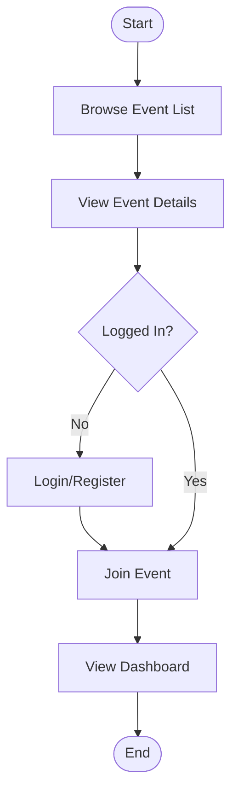

# Acaraga

[Acaraga]() is a platform designed to help users easily discover various sports events. From running and cycling to swimming and other activities, Acaraga provides complete information on event schedules, locations, and categories. Users can browse events, mark their interest by joining events, and track which events they plan to attend or have completed through a personal dashboard.

## 🤝 Team

- [Amar ismail khocan](https://github.com/ammarkhocan) (Team Lead, UI/UX Designer, Full Stack Developer)
- [Akhirudin salasa](https://github.com/salasaa) (Full Stack Developer, Backend Developer)
- [Endi suwandi](https://github.com/endisuwandii) (Full Stack Developer, Frontend Developer)
  [Purnomo arif](https://github.com/purnomoarif) (Full Stack Developer, Frontend Developer)

## Links

- Frontend Web: <https://acaraga.netlify.app>
- Backend API:

Repositories:

- Frontend Web: <https://github.com/acaraga/acaraga>
- Backend API: <https://github.com/acaraga/acaraga-api>

UI Designs:

- Figma: <https://www.figma.com/design/8AKzyTB0JjWHsYG8Tr77vH/Acaraga.com>

Inspirations:

- <https://www.eventbrite.com>
- <https://www.letsdothis.com>

## Architecture & Tech Stack

### Client = Presentation Layer (UI)

- HTML
- CSS
  - Tailwind CSS
  - Shadcn/ui
  - Lucide icons
- JavaScript
- TypeScript
- React
- React Router
- Docker

### Server = Application Layer (Business Logic)

- JavaScript
- TypeScript
- Hono
- OpenAPI
- Zod
- Docker

### Data Access Layer (Database)

- Prisma
- PostgreSQL
- Docker

### Flow Chart - Acaraga



## Features

- Home Page
  - Hero section with platform introduction
  - Featured sports events showcase
  - Quick category navigation
  - Search bar for quick event lookup

- Event List
  - Displays all sports events in event card format
  - Search bar (keywords: title, location, category)
  - Filtering options:
    - Sports category
    - Location

- Event Detail Page
  - Event banner/poster image
  - Event title and organizer name
  - Full event description
  - External registration link
  - Main event information:
    - Date & time
    - Full location with Google Maps embed
    - Sports category
    - Registration fee
  - **Join Event button** - Mark event to track participation
  - Register Event (redirects to the official registration website)
  - Terms & conditions (optional)

### User Profile Page

- View personal information

### Personal Dashboard (My Events)

- **Tab Navigation**
  - Interested
  - Going
  - Finished
- **Event Cards** for each status
  - Event thumbnail
  - Event name and date
  - Status indicator
  - Change status dropdown
  - Remove from tracking button
  - Link to event detail page
- Event count per status
- Empty state message when no events

# Entity Relationship Diagram (ERD)

View on [Prismaliser](https://prismaliser.app?code=bW9kZWwgVXNlciB7CiAgaWQgICAgICAgIFN0cmluZyAgIEBpZCBAZGVmYXVsdCh1bGlkKCkpCiAgbmFtZSAgICAgIFN0cmluZwogIGVtYWlsICAgICBTdHJpbmcgICBAdW5pcXVlCiAgcGFzc3dvcmQgIFN0cmluZwogIGNyZWF0ZWRBdCBEYXRlVGltZSBAZGVmYXVsdChub3coKSkKICB1cGRhdGVkQXQgRGF0ZVRpbWUgQHVwZGF0ZWRBdAoKICAvLyBSZWxhc2kga2UgdHJhY2tpbmcgZXZlbnQKICBldmVudFN0YXR1cyBVc2VyRXZlbnRTdGF0dXNbXQp9Cgptb2RlbCBFdmVudCB7CiAgaWQgICAgICAgICAgU3RyaW5nICAgQGlkIEBkZWZhdWx0KHVsaWQoKSkKICBzbHVnICAgICAgICBTdHJpbmcgICBAdW5pcXVlCiAgbmFtZSAgICAgICAgU3RyaW5nCiAgaW1hZ2VVcmwgICAgU3RyaW5nPwogIGRlc2NyaXB0aW9uIFN0cmluZz8KICBsb2NhdGlvbiAgICBTdHJpbmc_CgogIGRhdGVUaW1lU3RhcnQgRGF0ZVRpbWUKICBkYXRlVGltZUVuZCAgIERhdGVUaW1lCgogIHJlZ2lzdHJhdGlvblVybCBTdHJpbmc_CiAgcmVnaXN0cmF0aW9uRmVlIEludD8gICAvLyBCYW55YWsgZXZlbnQgZ3JhdGlzCgogIGNhdGVnb3J5ICAgQ2F0ZWdvcnk_IEByZWxhdGlvbihmaWVsZHM6IFtjYXRlZ29yeUlkXSwgcmVmZXJlbmNlczogW2lkXSkKICBjYXRlZ29yeUlkIFN0cmluZz8KCiAgLy8gUmVsYXNpIHRyYWNraW5nCiAgdXNlckV2ZW50U3RhdHVzIFVzZXJFdmVudFN0YXR1c1tdCgogIGNyZWF0ZWRBdCBEYXRlVGltZSBAZGVmYXVsdChub3coKSkKICB1cGRhdGVkQXQgRGF0ZVRpbWUgQHVwZGF0ZWRBdAp9Cgptb2RlbCBDYXRlZ29yeSB7CiAgaWQgICBTdHJpbmcgQGlkIEBkZWZhdWx0KHVsaWQoKSkKICBzbHVnIFN0cmluZyBAdW5pcXVlCiAgbmFtZSBTdHJpbmcgQHVuaXF1ZQoKICBldmVudHMgRXZlbnRbXQoKICBjcmVhdGVkQXQgRGF0ZVRpbWUgQGRlZmF1bHQobm93KCkpCiAgdXBkYXRlZEF0IERhdGVUaW1lIEB1cGRhdGVkQXQKfQoKbW9kZWwgVXNlckV2ZW50U3RhdHVzIHsKICBpZCAgICAgICAgU3RyaW5nICAgQGlkIEBkZWZhdWx0KHVsaWQoKSkKCiAgdXNlciAgICAgIFVzZXIgICAgIEByZWxhdGlvbihmaWVsZHM6IFt1c2VySWRdLCByZWZlcmVuY2VzOiBbaWRdKQogIHVzZXJJZCAgICBTdHJpbmcKCiAgZXZlbnQgICAgIEV2ZW50ICAgIEByZWxhdGlvbihmaWVsZHM6IFtldmVudElkXSwgcmVmZXJlbmNlczogW2lkXSkKICBldmVudElkICAgU3RyaW5nCgogIC8vIHN0YXR1czogSW50ZXJlc3RlZCB8IEdvaW5nIHwgRmluaXNoZWQKICBzdGF0dXMgICAgRXZlbnRTdGF0dXMKCiAgY3JlYXRlZEF0IERhdGVUaW1lIEBkZWZhdWx0KG5vdygpKQogIHVwZGF0ZWRBdCBEYXRlVGltZSBAdXBkYXRlZEF0CgogIEBAdW5pcXVlKFt1c2VySWQsIGV2ZW50SWRdKSAvLyAxIHVzZXIgaGFueWEgcHVueWEgMSBzdGF0dXMgdW50dWsgMSBldmVudAp9CgovLyBFbnVtIHVudHVrIHN0YXR1cyB0cmFja2luZwplbnVtIEV2ZW50U3RhdHVzIHsKICBJTlRFUkVTVEVECiAgR09JTkcKICBGSU5JU0hFRAp9Cg%3D%3D)

# Welcome to React Router!

A modern, production-ready template for building full-stack React applications using React Router.

[](https://stackblitz.com/github/remix-run/react-router-templates/tree/main/default)

## Features

- 🚀 Server-side rendering
- ⚡️ Hot Module Replacement (HMR)
- 📦 Asset bundling and optimization
- 🔄 Data loading and mutations
- 🔒 TypeScript by default
- 🎉 TailwindCSS for styling
- 📖 [React Router docs](https://reactrouter.com/)

## Getting Started

### Installation

Install the dependencies:

```bash
npm install
```

### Development

Start the development server with HMR:

```bash
npm run dev
```

Your application will be available at `http://localhost:5173`.

## Building for Production

Create a production build:

```bash
npm run build
```

## Deployment

### Docker Deployment

To build and run using Docker:

```bash
docker build -t my-app .

# Run the container
docker run -p 3000:3000 my-app
```

The containerized application can be deployed to any platform that supports Docker, including:

- AWS ECS
- Google Cloud Run
- Azure Container Apps
- Digital Ocean App Platform
- Fly.io
- Railway

### DIY Deployment

If you're familiar with deploying Node applications, the built-in app server is production-ready.

Make sure to deploy the output of `npm run build`

```
├── package.json
├── package-lock.json (or pnpm-lock.yaml, or bun.lockb)
├── build/
│   ├── client/    # Static assets
│   └── server/    # Server-side code
```

## Styling

This template comes with [Tailwind CSS](https://tailwindcss.com/) already configured for a simple default starting experience. You can use whatever CSS framework you prefer.

---

Built with ❤️ using React Router.
